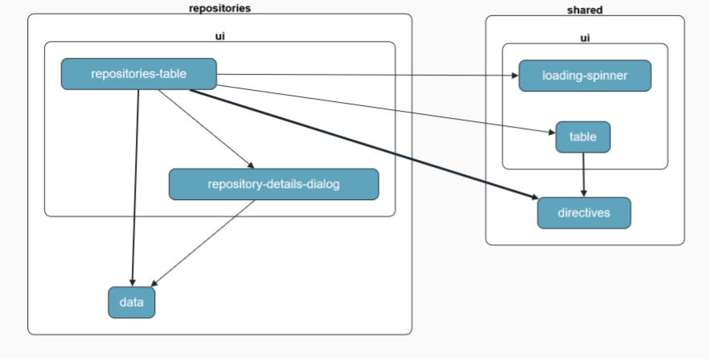

# Frontend

This project was generated using [Angular CLI](https://github.com/angular/angular-cli) version 20.1.2.

## Development server

To start a local development server, run:

```bash
ng serve
```

Once the server is running, open your browser and navigate to `http://localhost:4200/`. The application will automatically reload whenever you modify any of the source files.

## Building

To build the project run:

```bash
ng build
```

This will compile your project and store the build artifacts in the `dist/` directory. By default, the production build optimizes your application for performance and speed.

## Running unit tests

To execute unit tests with the [Karma](https://karma-runner.github.io) test runner, use the following command:

```bash
ng test
```

## Dependancy graphs

Repositories domain:


## Frameworks

To speed up development process, the open source design system flowbite was used, which in turn leverages Tailwind as the CSS framework.

rxjs and signals are being used for state management.
